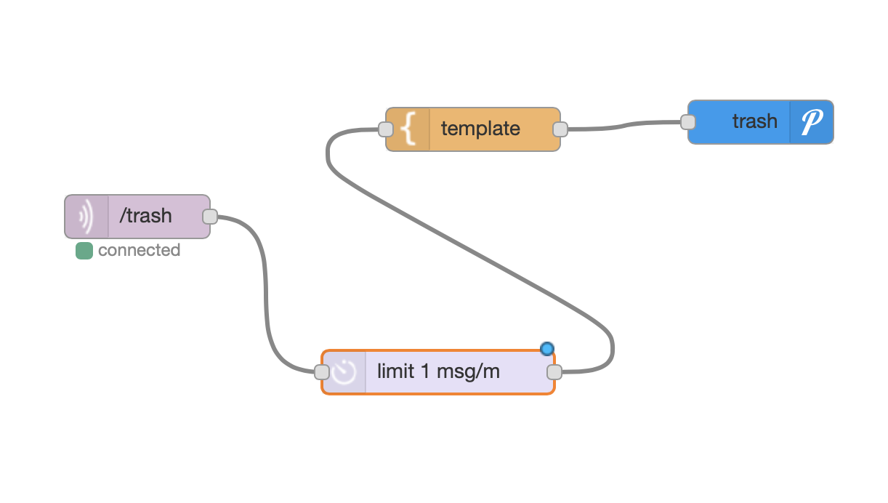
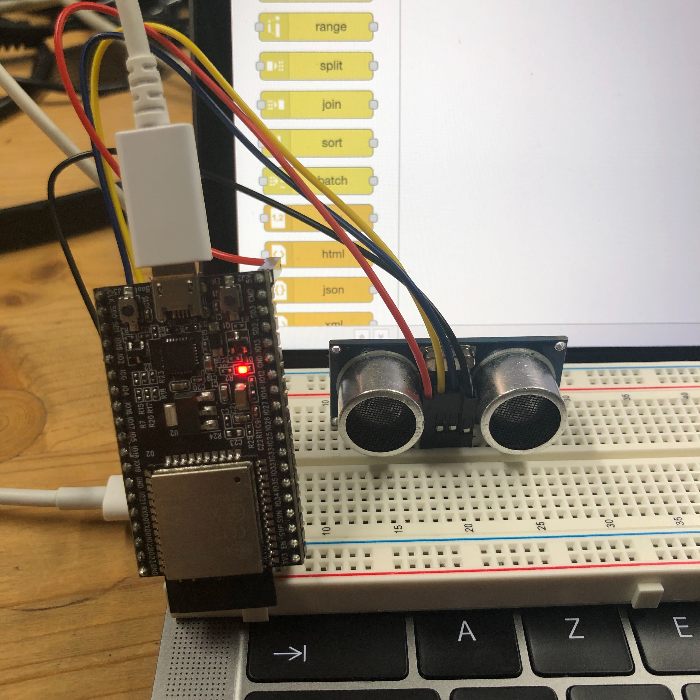

# trash-IoT

Ce projet à été réalisé par [@siham](https://github.com/siham87) et [@OSylla92](https://github.com/OSylla92)

## Video :
[](https://www.youtube.com/watch?v=u3gDtswal8)


## **Bibliothéque utilisée**
+ MQTT : [https://github.com/adafruit/Adafruit_MQTT_Library)
+ Wifi : [https://www.arduino.cc/en/Reference/WiFi)
+ uTimerLib : [https://github.com/Naguissa/uTimerLib]
+ Ultrasonic Sensor 1PC : [https://github.com/Martinsos/arduino-lib-hc-sr04)

## **Matériel**
+ esp32
+ Ultrasonic Sensor 1PC


## **Montage**


## **Code**

```
#include <uTimerLib.h>

#include <Adafruit_MQTT.h>
#include <Adafruit_MQTT_Client.h>

#include <WiFi.h>

#include <HCSR04.h>

UltraSonicDistanceSensor distanceSensor(16, 17);

WiFiClient wiFiClient;
Adafruit_MQTT_Client mqttClient(&wiFiClient, "192.168.0.101", 1883);
Adafruit_MQTT_Publish distancePublisher(&mqttClient, "/trash");


void distanceTimer() {
    double distance = distanceSensor.measureDistanceCm();
  Serial.println(distance);
  
   if(distance < 10  && distance > 0){
    distancePublisher.publish(distance);    
  }
}

void setup() {
  
  Serial.begin(115200);

  WiFi.begin("createch2019", "createch2019");
  delay(2000);
  Serial.print("IP address: ");
  Serial.println(WiFi.localIP());
  TimerLib.setInterval_s(distanceTimer, 1);


  
}  
void loop() {
  
  if (mqttClient.connected()) {
    mqttClient.processPackets(10000);
    mqttClient.ping();
  } else {
    mqttClient.disconnect();
    mqttClient.connect();
  }

}
```
## **Node-Red**




